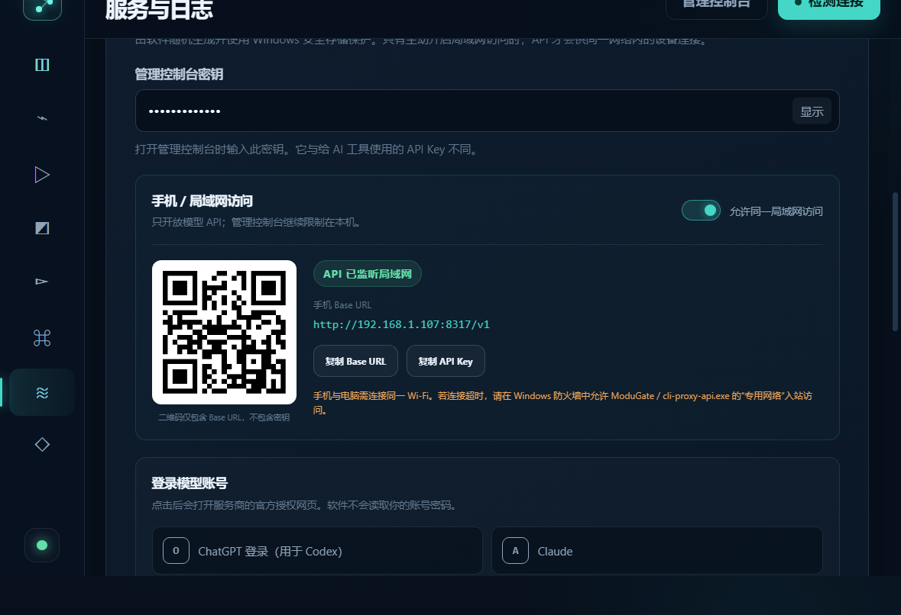
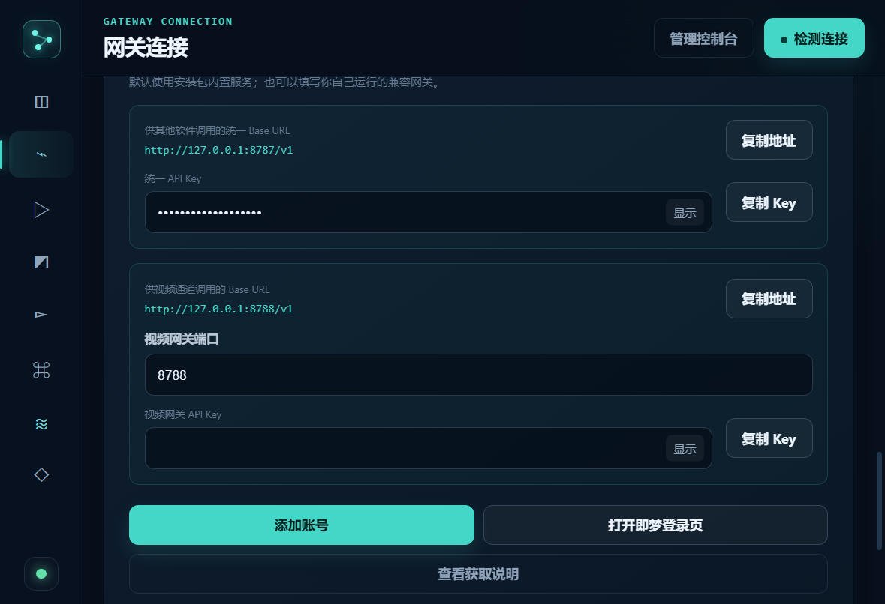
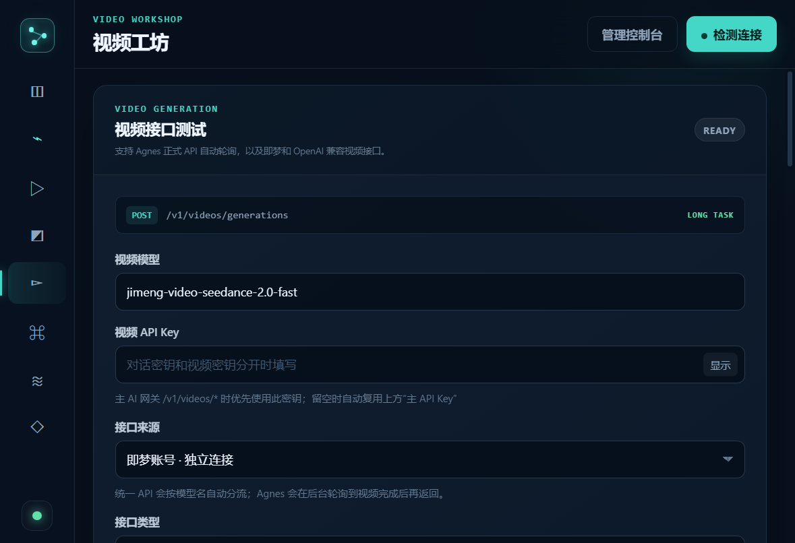
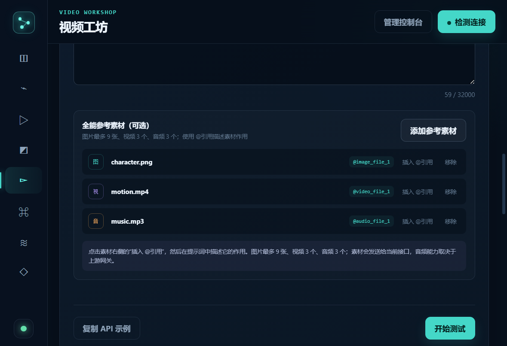

# ModuGate（模渡）

<p align="center">
  
</p>

<p align="center">
  <strong>把模型账号与视频服务接入本机，再通过统一、可复用的 API 调用。</strong>
</p>

ModuGate 是面向 Windows 的本地 AI 网关桌面工具。你可以登录 ChatGPT/Codex、Claude、Google/Gemini、Kimi、Grok 等模型账号，也可以接入即梦与 Agnes 视频服务；软件负责管理凭证、启动本地组件，并向其他软件提供兼容 API。

> 当前版本：`v0.5.2` · [前往 Releases 下载](https://github.com/Laity1m/modugate-desktop/releases/tag/v0.5.2)

## 它解决什么问题

- **账号转本地 API**：登录支持的模型账号后，向其他客户端提供 Base URL 与 API Key。
- **文本与视频隔离**：统一网关默认使用 `8787`，视频网关默认使用 `8788`，两套 Key 互不影响。
- **即梦开箱可用**：安装包内置即梦兼容驱动，无需另外安装 Node.js 或手动部署服务。
- **OAuth 多账号管理**：可选择当前账号、启用或停用账号、退出并删除本机凭证。
- **视频任务适配**：支持 Agnes、即梦/Seedance 以及 OpenAI 兼容视频接口。
- **局域网调用**：可让同一 Wi-Fi 下的手机或其他电脑调用模型 API。
- **本机安全存储**：API Key、管理密钥和即梦 sessionid 使用 Windows 安全存储保护。

<p align="center">
  
</p>

## 软件界面

### 登录模型账号，开放本地或局域网 API

轻量引擎可登录 ChatGPT/Codex、Claude、Google/Gemini、Kimi 和 Grok。启用局域网后，页面会显示手机可用的 Base URL 与二维码；二维码不包含 API Key。

<p align="center">
  
</p>

多个同服务商账号可以参与轮询，也可以把其中一个设为当前账号。账号还可单独停用，或使用“退出并删除”移除本机 OAuth 凭证。

### 即梦账号与独立视频网关

添加自己的 `sessionid` 或 `sessionid_ss` 后，ModuGate 会把 `jimeng-*`、`seedance-*` 模型自动路由到即梦驱动。文本统一接口与视频接口拥有独立地址和 Key。

<p align="center">
  
</p>

### 视频模型与 Agnes 中转

视频工坊支持 Agnes 正式 API、即梦账号独立连接，以及其他 OpenAI 兼容视频网关。任务提交后会自动查询状态并返回最终视频地址。

<p align="center">
  
</p>

### 图片、视频、音频全能参考

即梦 Seedance 模型可添加图片、视频和音频素材，并通过 `@image_file_1`、`@video_file_1`、`@audio_file_1` 在提示词中引用。

<p align="center">
  
</p>

## v0.5.2 主要能力

| 模块 | 能力 |
| --- | --- |
| 轻量 OAuth | ChatGPT/Codex、Claude、Google/Gemini、Kimi、Grok 登录与 API 中转 |
| 多账号 | 选择当前账号、轮询、启用/停用、退出并删除 |
| 即梦 | 内置 Windows x64 驱动、账号检测、Seedance 视频模型路由 |
| Agnes | 视频任务提交、状态轮询、失败原因透传、最终地址解析 |
| 独立视频网关 | `http://127.0.0.1:8788/v1` 与独立视频 API Key |
| 统一网关 | `http://127.0.0.1:8787/v1` 与模型自动分流 |
| 图片工坊 | OpenAI 兼容图片生成、编辑与本地历史记录 |
| 局域网 | 专用网络访问、二维码、Base URL 与 Key 分开复制 |

## 快速开始

1. 从 [GitHub Releases](https://github.com/Laity1m/modugate-desktop/releases/tag/v0.5.2) 下载 `ModuGate-Setup-0.5.2-x64.exe`。
2. 安装并启动 ModuGate，进入“服务与日志”。
3. 选择 ChatGPT/Codex、Claude 等服务商并完成官方网页授权。
4. 在“已连接账号”中选择要使用的账号。
5. 复制本地 Base URL 和 API Key，填入支持 OpenAI 兼容接口的客户端。
6. 如需视频模型，在“网关连接”中添加即梦账号或填写 Agnes API Key。

## API 地址

| 用途 | 默认 Base URL | 使用的 Key |
| --- | --- | --- |
| 文本、图片与统一模型列表 | `http://127.0.0.1:8787/v1` | 统一 API Key |
| 视频模型 | `http://127.0.0.1:8788/v1` | 视频网关 API Key |
| CLIProxyAPI 轻量引擎 | `http://127.0.0.1:8317/v1` | 轻量引擎 API Key |

获取视频模型列表：

```bash
curl http://127.0.0.1:8788/v1/models \
  -H "Authorization: Bearer YOUR_VIDEO_API_KEY"
```

提交兼容视频任务：

```bash
curl http://127.0.0.1:8788/v1/videos/generations \
  -H "Authorization: Bearer YOUR_VIDEO_API_KEY" \
  -H "Content-Type: application/json" \
  -d '{"model":"jimeng-video-seedance-2.0-fast","prompt":"海边日落，电影感镜头","ratio":"16:9","duration":5}'
```

## 下载与校验

- 安装包：`ModuGate-Setup-0.5.2-x64.exe`
- 文件大小：`132,392,751` 字节
- SHA-256：

```text
046A9B525634841E16E31B96153479A1096EA626B7983103A8520BC0B3A39D0F
```

首次运行时 Windows 可能显示安全提示。请只从本仓库 Release 页面下载，并核对 SHA-256。

## 从源码运行

需要 Windows、Node.js 22 与 npm：

```powershell
npm install
npm start
```

构建 Windows 安装包：

```powershell
npm run build:win
```

构建脚本会自动补齐并检查 CLIProxyAPI 与即梦驱动；任一运行组件不完整时，构建会直接失败。

## 安全与使用说明

- 不要公开分享 API Key、OAuth Token、sessionid 或配置文件。
- 局域网访问只应在可信家庭或办公网络中开启。
- “退出并删除”会移除本机保存的 OAuth 凭证，但不会删除服务商账号。
- 网页订阅账号转接为兼容 API 可能受到服务商条款限制，使用前请自行确认并承担账号风险。
- 重要或生产业务建议优先使用服务商官方 API，并为本地网关准备备份与限流。

<p align="center">
  
</p>

## 项目状态

`v0.5.2` 已通过 `40/40` 核心自动化测试、Electron 界面冒烟测试，以及安装包运行组件完整性检查。

