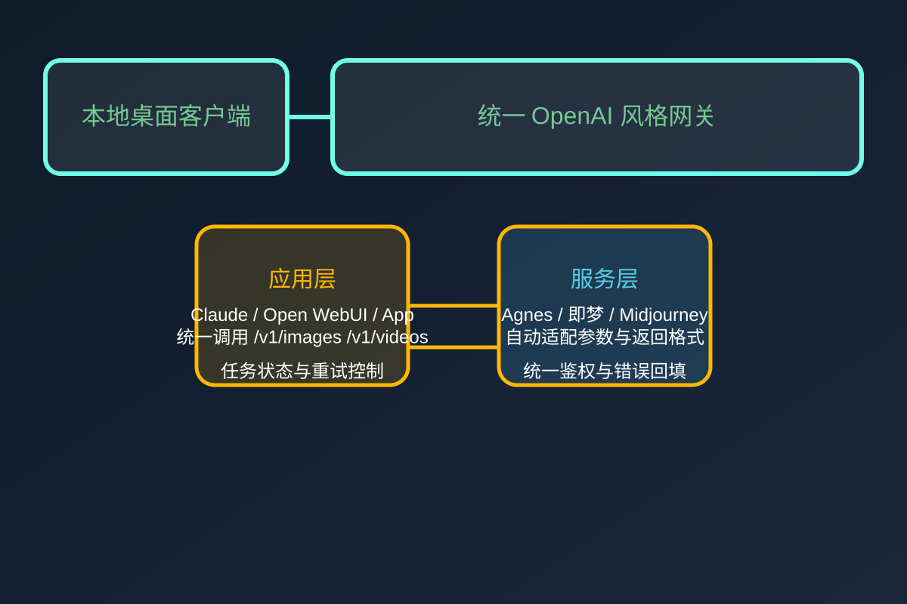
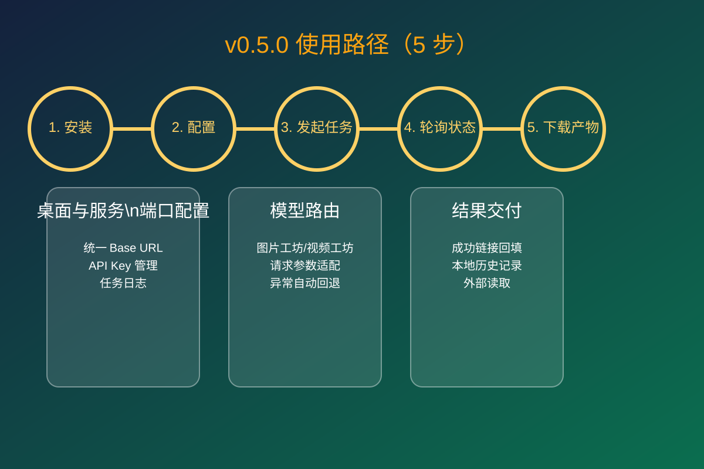
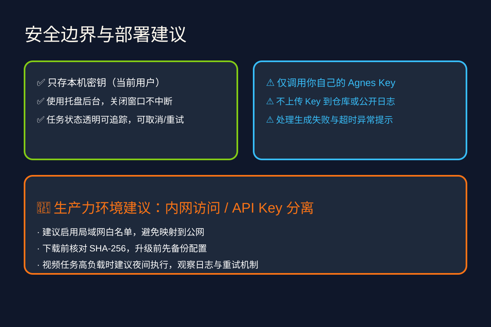

# ModuGate（模渡）

<p align="center">
  
</p>

> 一台 Windows 桌面网关，把多家模型服务统一为一套 OpenAI 兼容接口。

## 产品定位

ModuGate 主要解决的是：

- **减少重复接入**：不再为每个模型 SDK 重写一套调用链
- **本地可控**：配置与密钥在你的本机环境管理
- **任务透明**：任务提交、查询、失败和超时都可追踪
- **工作流友好**：支持图片、视频等常见场景的网关转接

<p align="center">
  
</p>

## v0.5.0 核心更新

### Agnes 视频中转

- 新增 Agnes 配置入口与 agnes-video-v2.0 预设
- 支持 /v1/videos 任务提交与状态轮询
- 自动兼容 video_id、task_id、嵌套地址字段解析
- 自动处理时长与分辨率参数，减轻手工适配成本

### 稳定性增强

- 任务失败/超时/取消路径更清晰
- 统一错误文本，便于快速排查
- 长任务可后台持续执行（关闭主窗口不阻塞）

### 统一能力延续

- 保留图片工坊、即梦视频、全能参考、局域网访问
- GET /v1/models 在配置 Agnes 后返回 agnes-video-v2.0

<p align="center">
  
</p>

## 3 分钟快速上手

1. 安装 ModuGate-Setup-0.5.0-x64.exe
2. 在网关连接中配置 Agnes Key，点击“应用预设”
3. 进入视频工坊提交测试任务，确认结果可回填
4. 外部客户端配置统一 Base URL 与统一 API Key，模型选 agnes-video-v2.0


## 下载与校验

- 安装文件：ModuGate-Setup-0.5.0-x64.exe
- SHA-256：

```text
250D145E9116906BFDF562AA8B996CC190FA59022ED19454BE6CCE8584F25E2E
```

> 首次运行 Windows 可能出现安全提示（未购买商业代码签名证书）。请核对来源并只从本仓库 Release 页面下载。

## 安全建议

- 不要公开泄露 API Key / Session / Token
- 建议仅在可信局域网开放本地服务
- 更新前先备份关键配置与历史记录